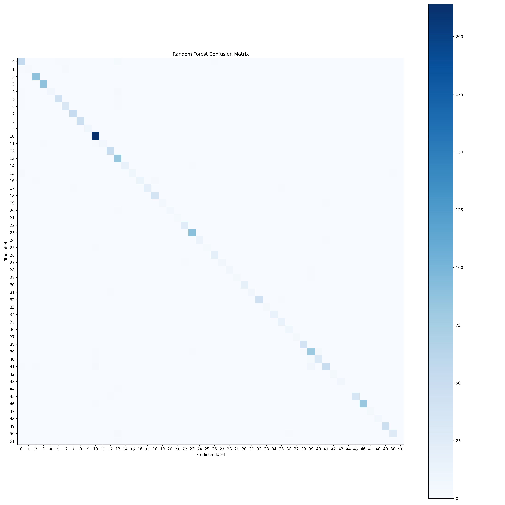

# Random Forest Report: Vietnamese Traffic Sign Classification

## 1. Title

**Vietnamese Traffic Sign Classification using Random Forest**
**ML2 Course Project — Random Forest Branch**

Student: `[Your Name]`
Team: `[Your Team Name]`
Date: `[Submission Date]`

---

## 2. Introduction

This report presents the Random Forest branch of the Vietnamese Traffic Sign Recognition project. The overall project focuses on recognizing Vietnamese traffic signs using different machine learning and deep learning approaches. In this branch, the main objective is to classify traffic signs using a traditional machine learning model: Random Forest.

Unlike object detection models such as YOLO, Random Forest does not directly detect traffic signs from full road-scene images. Therefore, the original images must be preprocessed before being used by the model. In this project, YOLO-format annotation files are used to crop traffic sign regions from original images. The cropped signs are then resized, normalized, flattened into feature vectors, and classified using a Random Forest classifier.

The Random Forest branch is useful as a traditional machine learning baseline. It helps compare how classical machine learning performs on image classification tasks when compared with other approaches such as SVM or YOLO-based methods.

---

## 3. Objective

The objective of this branch is to build a Random Forest classifier for Vietnamese traffic sign classification.

The specific goals are:

* Convert YOLO-format annotations into cropped traffic sign images.
* Prepare a cropped image dataset for Random Forest.
* Resize and normalize cropped traffic sign images.
* Flatten each image into a one-dimensional feature vector.
* Train a Random Forest classifier.
* Evaluate the model using accuracy, classification report, and confusion matrix.
* Analyze the strengths and limitations of using Random Forest for image-based traffic sign classification.

In this branch, the model receives cropped traffic sign images as input and predicts the corresponding traffic sign class.

---

## 4. Dataset Description

The dataset contains original road-scene images and YOLO-format annotation files. Each annotation file contains information about the location and class of traffic signs in the corresponding image.

The original dataset is organized as follows:

```txt
archive/
├── images/
│   ├── image_1.jpg
│   ├── image_2.jpg
│   └── ...
├── labels/
│   ├── image_1.txt
│   ├── image_2.txt
│   └── ...
└── split_dataset/
    ├── train_files.txt
    └── test_files.txt
```

The `images/` folder contains original traffic-scene images.
The `labels/` folder contains YOLO-format annotation files.
The `split_dataset/` folder contains the training and testing image lists.

Each YOLO label file follows this format:

```txt
class_id x_center y_center width height
```

Where:

* `class_id` is the traffic sign class.
* `x_center` and `y_center` represent the center point of the bounding box.
* `width` and `height` represent the size of the bounding box.
* All bounding box values are normalized between `0` and `1`.

Before cropping, the normalized YOLO coordinates are converted into real pixel coordinates based on the width and height of the original image.

The dataset split used in this branch is:

```txt
Training images: 2552
Testing images: 639
```

Note: The number of cropped traffic sign images may be different from the number of original images. One original image can contain multiple traffic signs, so it can generate multiple cropped samples. Some images may also be skipped if their label files are missing, empty, or invalid.

---

## 5. Methodology Overview

The Random Forest branch follows this pipeline:

```txt
Original traffic-sign images
→ Read YOLO-format annotation files
→ Convert normalized bounding boxes into pixel coordinates
→ Crop traffic sign regions
→ Add 5% padding around the bounding box
→ Save cropped signs into class folders
→ Resize cropped images to 64 × 64
→ Normalize pixel values to [0, 1]
→ Flatten each image into a feature vector
→ Train Random Forest classifier
→ Evaluate model performance
```

This pipeline transforms the original image-based dataset into a tabular feature representation that can be processed by Random Forest.

---

## 6. Preprocessing Pipeline

### 6.1 Reading Original Images and Labels

The preprocessing stage starts by reading image names from the predefined train and test split files:

```txt
archive/split_dataset/train_files.txt
archive/split_dataset/test_files.txt
```

For each image, the corresponding label file is loaded from:

```txt
archive/labels/
```

If an image file is missing, the program skips that image. If the label file is missing or empty, the image is also skipped. This prevents invalid data from being used during training.

---

### 6.2 Converting YOLO Bounding Boxes

YOLO annotation values are normalized, so they must be converted into real pixel coordinates before cropping.

For each bounding box:

```txt
x_center_pixel = x_center × image_width
y_center_pixel = y_center × image_height
box_width_pixel = width × image_width
box_height_pixel = height × image_height
```

Then the corner coordinates are calculated as:

```txt
x1 = x_center_pixel - box_width_pixel / 2
y1 = y_center_pixel - box_height_pixel / 2
x2 = x_center_pixel + box_width_pixel / 2
y2 = y_center_pixel + box_height_pixel / 2
```

These coordinates define the traffic sign region in the original image.

---

### 6.3 Cropping Traffic Signs

After converting the bounding box coordinates, the traffic sign region is cropped from the original image.

A padding value of `5%` is added around the bounding box:

```txt
padding = 0.05
```

This padding helps avoid cutting off the edge of the traffic sign. After applying padding, the coordinates are clipped to ensure they stay inside the image boundary.

The cropped signs are saved into folders based on their class labels:

```txt
rf_dataset/
├── train/
│   ├── class_0/
│   ├── class_1/
│   └── ...
└── test/
    ├── class_0/
    ├── class_1/
    └── ...
```

This step converts the original object detection dataset into a cropped image classification dataset.

---

### 6.4 Crop Checking

Before creating the full cropped dataset, one sample image is used to check whether the bounding box conversion and cropping process are correct.

The crop checking step loads one image and its label file, converts the YOLO bounding box into pixel coordinates, crops the traffic sign, and saves the result into:

```txt
check_crops/
```

This step is important because if the crop is wrong, the Random Forest model will learn from incorrect image regions.

---

## 7. Feature Extraction

Random Forest requires tabular input. Therefore, each cropped traffic sign image must be converted into a fixed-length numerical feature vector.

In this branch, raw pixel values are used as features.

Each cropped image is processed as follows:

1. Read the cropped image from `rf_dataset/train/` or `rf_dataset/test/`.
2. Resize the image to `64 × 64`.
3. Normalize pixel values to the range `[0, 1]` by dividing by `255.0`.
4. Flatten the image into a one-dimensional vector.
5. Save the feature arrays as `.npy` files.

For an RGB image, the number of features is:

```txt
64 × 64 × 3 = 12288 features
```

The generated feature files are saved in:

```txt
rf_features/
├── X_train.npy
├── y_train.npy
├── X_test.npy
└── y_test.npy
```

Where:

* `X_train.npy` contains training feature vectors.
* `y_train.npy` contains training labels.
* `X_test.npy` contains testing feature vectors.
* `y_test.npy` contains testing labels.

This feature extraction method is simple and easy to implement. However, because it uses flattened raw pixels, it does not preserve spatial image structure as well as CNN-based methods.

---

## 8. Random Forest Model

Random Forest is an ensemble learning algorithm based on multiple decision trees. Each decision tree learns different rules from the training data. During prediction, each tree gives a class prediction, and the final output is selected by majority voting.

In this project, the Random Forest model is trained on flattened image feature vectors.

The model configuration is:

```python
RandomForestClassifier(
    n_estimators=100,
    max_depth=None,
    max_features="sqrt",
    random_state=42,
    n_jobs=-1,
    class_weight="balanced"
)
```

The meaning of each parameter is shown below:

| Parameter                 | Meaning                                                            |
| ------------------------- | ------------------------------------------------------------------ |
| `n_estimators=100`        | Uses 100 decision trees in the forest                              |
| `max_depth=None`          | Allows trees to grow until fully expanded                          |
| `max_features="sqrt"`     | Uses the square root of the total number of features at each split |
| `random_state=42`         | Makes the experiment reproducible                                  |
| `n_jobs=-1`               | Uses all available CPU cores for faster training                   |
| `class_weight="balanced"` | Gives higher weight to minority classes                            |

The trained model is saved as:

```txt
rf_models/random_forest_flatten.pkl
```

---

## 9. Hyperparameter Comparison

Hyperparameter comparison is important because Random Forest performance can change depending on the model settings.

The main hyperparameters considered in this branch are:

| Hyperparameter | Meaning                                     | Expected Effect                                                           |
| -------------- | ------------------------------------------- | ------------------------------------------------------------------------- |
| `n_estimators` | Number of decision trees                    | More trees usually make the result more stable but increase training time |
| `max_depth`    | Maximum depth of each tree                  | Deeper trees can learn more complex patterns but may overfit              |
| `max_features` | Number of features considered at each split | Controls randomness and diversity between trees                           |
| `class_weight` | Class balancing strategy                    | Helps reduce the effect of class imbalance                                |

---

### 9.1 Comparison of `n_estimators`

The parameter `n_estimators` controls the number of decision trees in the forest.

| `n_estimators` | Expected Behavior                                     |
| -------------: | ----------------------------------------------------- |
|           `50` | Faster training, but the model may be less stable     |
|          `100` | Balanced choice between performance and training time |
|          `200` | More stable prediction, but longer training time      |

Increasing the number of trees does not always greatly improve accuracy. After a certain point, adding more trees mainly improves stability rather than learning significantly new information.

---

### 9.2 Comparison of `max_depth`

The parameter `max_depth` controls how deep each decision tree can grow.

| `max_depth` | Expected Behavior                                                   |
| ----------: | ------------------------------------------------------------------- |
|        `10` | Simpler model, lower overfitting risk, but may underfit             |
|        `20` | More flexible model, can learn more complex patterns                |
|      `None` | Fully expanded trees, high flexibility, but higher overfitting risk |

In this branch, `max_depth=None` is used in the final model to allow the decision trees to learn complex visual patterns from flattened image features.

---

### 9.3 Comparison of `max_features`

The parameter `max_features` controls how many features each tree can consider at each split.

| `max_features` | Expected Behavior                                         |
| -------------- | --------------------------------------------------------- |
| `"sqrt"`       | Common choice for classification, improves tree diversity |
| `"log2"`       | Uses fewer features, increases randomness                 |
| `None`         | Uses all features, may reduce diversity between trees     |

In this branch, `max_features="sqrt"` is used because the input vector has many features. If every tree always considers all features, the trees may become too similar. Using `"sqrt"` increases randomness and makes the forest more diverse.

---

### 9.4 Comparison of `class_weight`

Traffic sign datasets may be imbalanced. Some traffic sign classes may appear more often than others.

| `class_weight` | Expected Behavior                      |
| -------------- | -------------------------------------- |
| `None`         | All classes are treated equally        |
| `"balanced"`   | Minority classes receive higher weight |

In this branch, `class_weight="balanced"` is used to reduce the negative effect of class imbalance.

---

### 9.5 Hyperparameter Experiment Table

The following table can be used to compare different Random Forest settings.

> Replace `To be updated` with real results after running each experiment.

| Experiment | `n_estimators` | `max_depth` | `max_features` | `class_weight` |      Accuracy |
| ---------- | -------------: | ----------: | -------------- | -------------- | ------------: |
| RF-1       |             50 |          10 | sqrt           | balanced       | To be updated |
| RF-2       |            100 |          20 | sqrt           | balanced       | To be updated |
| RF-3       |            100 |        None | sqrt           | balanced       | To be updated |
| RF-4       |            200 |        None | sqrt           | balanced       | To be updated |
| RF-5       |            100 |        None | log2           | balanced       | To be updated |
| RF-6       |            100 |        None | sqrt           | None           | To be updated |

The final selected model uses:

```txt
n_estimators = 100
max_depth = None
max_features = sqrt
class_weight = balanced
```

This configuration is selected because it provides a reasonable balance between model flexibility, class balancing, and training efficiency.

---

## 10. Evaluation Metrics

The trained Random Forest model is evaluated on the test set.

The evaluation metrics include:

| Metric           | Meaning                                                           |
| ---------------- | ----------------------------------------------------------------- |
| Accuracy         | Overall percentage of correct predictions                         |
| Precision        | Among predicted samples of a class, how many are actually correct |
| Recall           | Among actual samples of a class, how many are correctly predicted |
| F1-score         | Harmonic mean of precision and recall                             |
| Confusion Matrix | Shows correct and incorrect predictions between classes           |

Accuracy gives a general view of model performance. However, because traffic sign datasets may be imbalanced, precision, recall, F1-score, and the confusion matrix are also important.

The classification report is saved as:

```txt
rf_results/classification_report.txt
```

The confusion matrix is saved as:

```txt
rf_results/confusion_matrix.png
```

---

## 11. Results

The trained Random Forest model is evaluated on the independent test set.

> Replace the values below with the actual results from `rf_results/classification_report.txt`.

```txt
Test Accuracy: To be updated
```

The evaluation script generates:

```txt
rf_results/
├── classification_report.txt
├── confusion_matrix.npy
└── confusion_matrix.png
```

The classification report includes precision, recall, F1-score, and support for each class.

Example report format:

| Class        |     Precision |        Recall |      F1-score |       Support |
| ------------ | ------------: | ------------: | ------------: | ------------: |
| class_0      | To be updated | To be updated | To be updated | To be updated |
| class_1      | To be updated | To be updated | To be updated | To be updated |
| class_2      | To be updated | To be updated | To be updated | To be updated |
| macro avg    | To be updated | To be updated | To be updated | To be updated |
| weighted avg | To be updated | To be updated | To be updated | To be updated |

The confusion matrix helps identify which traffic sign classes are correctly classified and which classes are commonly confused.

---

## 12. Figures

This report should include figures to make the Random Forest branch easier to understand.

### Figure 1. Example Original Image

```markdown

```

**Caption:** Example original road-scene image containing traffic signs.

---

### Figure 2. Bounding Box / Annotation Example

```markdown

```

**Caption:** YOLO bounding box used to locate the traffic sign before cropping.

---

### Figure 3. Random Forest Pipeline

```markdown

```

**Caption:** Random Forest preprocessing pipeline from original images to flattened feature vectors.

---

### Figure 4. Cropped Traffic Sign Examples

```markdown

```

**Caption:** Examples of cropped traffic sign images used as Random Forest input.

---

### Figure 5. Image Flattening Illustration

```markdown

```

**Caption:** Flattening process that converts a `64 × 64 × 3` cropped image into a `12288`-dimensional feature vector.

---

### Figure 6. Hyperparameter Accuracy Comparison

```markdown

```

**Caption:** Accuracy comparison of different Random Forest hyperparameter settings.

---

### Figure 7. Confusion Matrix

```markdown

```

**Caption:** Confusion matrix of the Random Forest model on the test set.

---

### Figure 8. Correct and Incorrect Predictions

```markdown

```

**Caption:** Examples of correct and incorrect predictions made by the Random Forest model.

---

## 13. Discussion

The Random Forest model can classify cropped traffic sign images after preprocessing. The pipeline is clear and suitable for a traditional machine learning approach because each image is transformed into a numerical feature vector.

One advantage of this branch is that the method is simple and interpretable compared with deep learning models. Random Forest can work directly with numerical features and does not require a complex neural network architecture.

However, this approach also has limitations. Since the model uses flattened raw pixel values, it does not preserve the spatial structure of images. For image classification tasks, spatial information such as edges, shapes, and local patterns is very important. CNN-based models are usually stronger because they can learn spatial features directly from images.

Misclassification may happen for several reasons:

* Some traffic signs have similar shapes.
* Some traffic signs have similar colors.
* Cropped images may be blurry or low-resolution.
* Some objects may be too small.
* Some bounding boxes may not crop the traffic sign perfectly.
* Some classes may have fewer training samples than others.

The confusion matrix should be used to analyze which classes are often confused. If two classes are frequently confused, it may indicate that they are visually similar or that the model needs better feature extraction.

---

## 14. Limitations

The Random Forest branch has several limitations:

* Random Forest cannot detect traffic signs directly from full road-scene images.
* The model requires cropped traffic sign images as input.
* Flattened pixel features do not preserve spatial relationships.
* Raw pixel values may not be strong enough for complex image classification.
* The model may be sensitive to crop quality, blur, lighting, and small objects.
* The current model uses fixed hyperparameters.
* Class names are represented by numeric labels unless a class mapping file is added.
* The model may perform worse than CNN-based methods on visual recognition tasks.

These limitations do not mean the model is useless. Instead, they show that Random Forest is more suitable as a traditional machine learning baseline for comparison.

---

## 15. Future Improvements

Several improvements can be added in the future:

* Add `metadata/classes.json` to map numeric class IDs to readable traffic sign names.
* Add a prediction demo for one new cropped traffic sign image.
* Use HOG features instead of only raw pixel values.
* Use color histogram features to capture color information.
* Use CNN embeddings as feature vectors for Random Forest.
* Tune hyperparameters using GridSearchCV or RandomizedSearchCV.
* Add a validation set for model selection.
* Compare Random Forest results with SVM and YOLO results.
* Analyze the most confused classes using the confusion matrix.
* Add examples of correct and incorrect predictions.

---

## 16. Conclusion

This report presented the Random Forest branch for Vietnamese traffic sign classification. The pipeline includes YOLO-based cropping, image resizing, pixel normalization, image flattening, Random Forest training, and model evaluation.

The Random Forest model provides a traditional machine learning baseline for the project. It shows how classical machine learning can be applied to image classification after converting images into feature vectors. Although this approach has limitations because it does not preserve spatial image structure, it is still useful for comparison with other approaches such as SVM and YOLO-based methods.

Overall, the Random Forest branch successfully demonstrates a complete machine learning workflow: data preprocessing, feature extraction, model training, evaluation, and result analysis.

---

## 17. References / Credits

This report is part of the ML2 course project.

Project branch:

```txt
Random Forest approach for Vietnamese Traffic Sign Classification
```

Main tools and libraries used:

* Python
* NumPy
* OpenCV
* scikit-learn
* Matplotlib
* Joblib

Team approaches:

* YOLO approach: Object detection
* SVM approach: Traditional machine learning classification
* Random Forest approach: Traditional machine learning classification

---

## 18. Appendix

### Appendix A. Main Random Forest Configuration

```python
RandomForestClassifier(
    n_estimators=100,
    max_depth=None,
    max_features="sqrt",
    random_state=42,
    n_jobs=-1,
    class_weight="balanced"
)
```

---

### Appendix B. Output Folders

```txt
check_crops/                 # Sample cropped images for checking
rf_dataset/                  # Cropped train/test dataset
rf_features/                 # NumPy feature arrays
rf_models/                   # Saved Random Forest model
rf_results/                  # Evaluation reports and confusion matrix
```

---

### Appendix C. Important Files

| File                        | Purpose                                                                   |
| --------------------------- | ------------------------------------------------------------------------- |
| `crop_check.py`             | Checks whether YOLO bounding boxes are converted and cropped correctly    |
| `create_rf_dataset.py`      | Creates cropped traffic sign dataset from original images and YOLO labels |
| `prepare_rf_features.py`    | Converts cropped images into feature vectors                              |
| `train_random_forest.py`    | Trains the Random Forest classifier                                       |
| `evaluate_random_forest.py` | Evaluates the trained model and saves results                             |
| `main.ipynb`                | Notebook version for experimentation and explanation                      |

---

### Appendix D. Suggested Figure Checklist

| Figure   | Content                           | Status      |
| -------- | --------------------------------- | ----------- |
| Figure 1 | Original image example            | To be added |
| Figure 2 | Bounding box example              | To be added |
| Figure 3 | Random Forest pipeline            | To be added |
| Figure 4 | Cropped sign examples             | To be added |
| Figure 5 | Flattening illustration           | To be added |
| Figure 6 | Hyperparameter comparison chart   | To be added |
| Figure 7 | Confusion matrix                  | To be added |
| Figure 8 | Correct and incorrect predictions | To be added |
