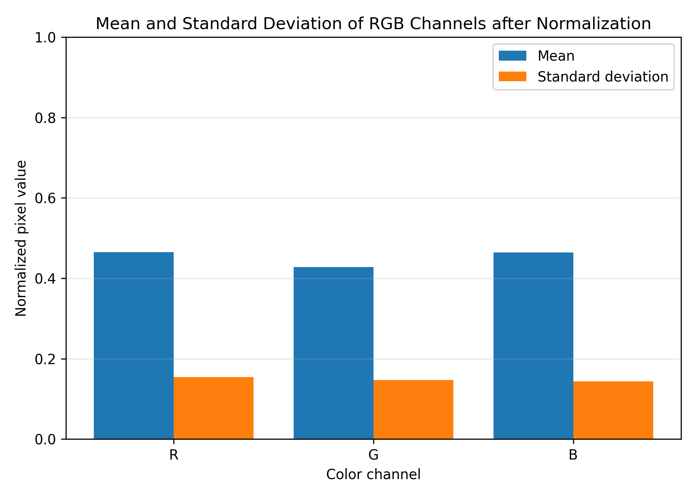

# Random Forest Report for Traffic Sign Classification

## 1. Overview

This report describes the Random Forest part of the traffic sign classification project. The goal of this part is to classify cropped traffic sign images using a traditional machine learning approach.

The workflow includes image cropping, resizing, normalization, feature extraction, model training, hyperparameter comparison, and final evaluation.


## 2. Dataset Preparation

The original dataset contains traffic sign images with annotation files. Since one image may contain one or more traffic signs, the annotated traffic sign objects were cropped first. Each cropped object was then used as one classification sample.

The dataset was split into training and testing sets.

| Dataset      | Number of Images |
| ------------ | ---------------: |
| Training set |             6689 |
| Testing set  |             1645 |

Each cropped image belongs to one traffic sign class.


## 3. Exploratory Data Analysis

To understand the image data, the RGB channel statistics were analyzed after normalizing pixel values to the range `[0, 1]`.



The figure shows the mean and standard deviation of the R, G, and B channels. This analysis is useful because traffic signs strongly depend on color information such as red, blue, yellow, white, and black.


## 4. Feature Extraction

Each cropped traffic sign image was resized to `64 × 64` pixels. Then, the RGB image was flattened into a one-dimensional vector.

For each image:

```text
64 × 64 × 3 = 12288 features
```

The feature extraction pipeline is:

```text
Cropped image → Resize to 64×64 → Normalize to [0,1] → Flatten → Feature vector
```

The extracted features were saved into NumPy files:

```text
rf_features/X_train.npy
rf_features/X_test.npy
rf_features/y_train.npy
rf_features/y_test.npy
```

The class names were also saved in:

```text
rf_features/class_names.json
```


## 5. Random Forest Model

Random Forest was selected as the traditional machine learning classifier for this part. It works by training many decision trees and combining their predictions through majority voting.

This makes the model more stable than a single decision tree and helps reduce overfitting.

The main model pipeline is:

```text
Image features → Random Forest → Predicted traffic sign class
```


## 6. Hyperparameter Comparison

Several Random Forest settings were tested to compare how model performance changes with different parameters.

### Effect of Tree Depth


This figure compares the model accuracy with different maximum tree depths. It helps identify whether deeper trees improve performance or cause overfitting.

### Effect of Number of Estimators


This figure shows the relationship between the number of trees and classification accuracy. Increasing the number of estimators can improve stability, but after a certain point, the improvement becomes smaller.

### Training Time


This figure shows that training time increases when the number of estimators becomes larger. Therefore, the final model should balance accuracy and training cost.


## 7. Experimental Results

The Random Forest model achieved strong performance on the testing set.

| Metric             |  Value |
| ------------------ | -----: |
| Accuracy           | 96.41% |
| Macro Precision    | 94.15% |
| Macro Recall       | 89.43% |
| Macro F1-score     | 91.24% |
| Weighted Precision | 96.45% |
| Weighted Recall    | 96.41% |
| Weighted F1-score  | 96.25% |

The model was evaluated on 1,645 test images. The overall accuracy reached 96.41%, showing that the Random Forest classifier performed well on cropped traffic sign images.

The weighted average scores are high, with a weighted F1-score of 96.25%. This means the model performs well for most samples in the dataset. However, the macro average is lower than the weighted average because some classes have very few testing samples. For example, classes 44 and 51 only have one sample each, and both received an F1-score of 0. This shows that class imbalance still affects the model's performance on rare classes.

The detailed classification report was saved in:

```text
rf_results/classification_report.txt
```

The confusion matrix was also generated to analyze which classes were predicted correctly and which classes were confused with each other.


## 8. Discussion

The Random Forest model achieved good accuracy using flattened RGB pixel features. This shows that traditional machine learning can still perform well when the traffic signs are properly cropped and preprocessed.

However, this approach also has some limitations. Since the model uses flattened pixel values, it may be sensitive to lighting changes, rotation, image quality, and background noise. It also does not automatically learn spatial features like deep learning models.

Even so, Random Forest is simple, fast to test, easy to explain, and suitable as a traditional machine learning baseline for this project.


## 9. Conclusion

This report presented the Random Forest part of the traffic sign classification project. The workflow includes dataset preparation, RGB normalization analysis, feature extraction, hyperparameter comparison, and model evaluation.

The final Random Forest model achieved good testing accuracy and provides a strong baseline for traffic sign classification using traditional machine learning.
